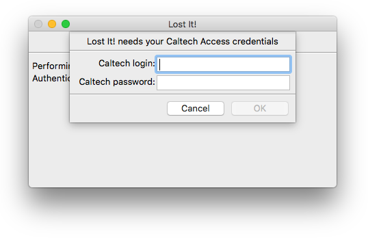
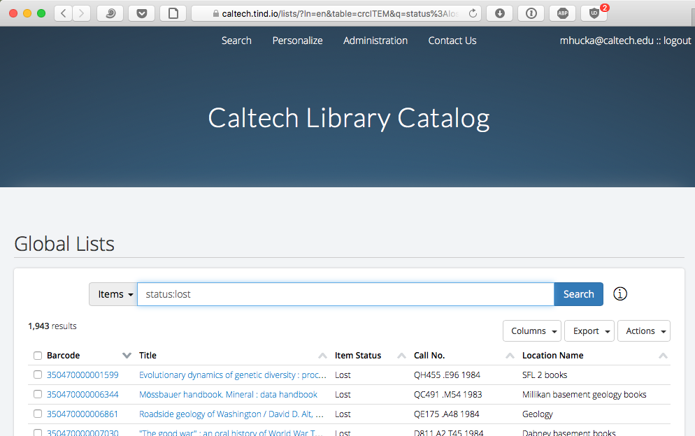
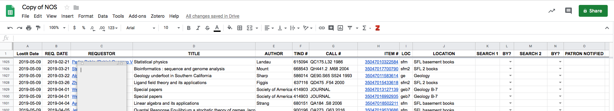

Lost It!
========

When an item is discovered missing from the shelves of the Caltech Library stacks, the information needs to be recorded in the Caltech TIND server as well as a tracking spreadsheet kept by the Library circulation staff. _Lost It!_ is a program to simplify the process of doing this.

*Authors*:      [Michael Hucka](http://github.com/mhucka) 
*Repository*:   [https://github.com/caltechlibrary/lostit](https://github.com/caltechlibrary/lostit) 
*License*:      BSD/MIT derivative &ndash; see the [LICENSE](LICENSE) file for more information

Table of Contents
-----------------
* [Introduction](#-introduction)
* [Installation instructions](#-installation-instructions)
* [Basic operation](#︎-basic-operation)
* [Configuration](#-configuration)
* [Getting help and support](#-getting-help-and-support)
* [Do you like it?](#-do-you-like-it)
* [Acknowledgments](#︎-acknowledgments)
* [Copyright and license](#︎-copyright-and-license)

☀ Introduction
-----------------------------

The Caltech Library's Circulation Desk handles, among other things, tracking holdings that have gone missing.  They do this by marking the corresponding record's status in the information management system used by Caltech (TIND) as well as putting the information into a Google spreadsheet.  However, copy-pasting the information into the spreadsheet is tedious and error-prone.

_Lost It!_ is aimed at automating more of this procedure to reduce frustration and possible errors.  It uses Shibboleth to log in to the Caltech Library system, scrapes TIND to get the necessary information, and updates the Google spreadsheet used to track lost items.  Once done, if lost items were found, it also sends email to a library mailing list to alert humans about new loses.

✺ Installation instructions
---------------------------

The developers provide an installer program for Caltech Library users.  Please contact the developers to get a copy of the installer program for Windows 7, Windows 10, or macOS 10.12+.  Note also that installation of _Lost It!_ on Windows requires administrator priviledges.

You can also build _Lost It!_ from sources.  Information about building the application can be found in the project [Wiki](https://github.com/caltechlibrary/lostit/wiki).

▶︎ Basic operation
------------------

_Lost It!_ has both a GUI interface and a command-line interface.  The GUI interface is simple: a user starts the program in a typical way (e.g., by double-clicking the program icon) and _Lost It!_ creates a main window, then immediately begins its work by connecting to Caltech.tind.io and asking the user for login credentials.  The image at right depicts the first dialog. After the user types in a login name and password, and clicks the **OK** button, the program does the following behind the scenes:

1. Searches Caltech.tind.io for items with status "lost"
2. Extracts the data returned by TIND
3. Downloads the Google spreadsheet used by the Circulation staff
4. Compares the two data sources to determine if the TIND search returned new lost items
5. Adds any new lost items to the Google spreadsheet
7. (Optionally) opens the spreadsheet in a browser so the user can see it
8. If there were new lost items, sends an email message to a library mailing list to alert librarians

Items in the spreadsheet are assumed to be never deleted.  "New lost items" are determined in the following way: _Lost It!_ searches the Caltech.tind.io global list for items with `status:lost`, compares their bar codes to the bar codes requested in the Google spreadsheet as well as the dates that they were added to the spreadsheet, and writes out records with never-before lost barcodes or (if a barcode has been seen before) barcodes that were added on a previous date.  (The latter catches the situation where an item has been reported lost in the past, then found again in the past, then lost again at some later date.  Without tracking the date it was added to the spreadsheet, _Lost It!_ would simply assume it was already know to be lost, whereas in reality it might have been found for a time and recently re-lost.)

Unless an error occurs, _Lost It!_ presents only one other dialog: to ask the user whether the Google spreadsheet should be opened in a browser window.  If the user clicks the **Yes** button, it's opened.

Finally, _Lost It!_ will by default send mail to a library mailing list to alert people if newly lost items have been found. _Lost It!_ exits after that.

### _Additional details and assumptions_

The following are some additional details about how _Lost It!_ works and the assumptions built into it:

* When looking up records in the Google spreadsheet of lost items, it looks at the two first tabs.  The tab lookup is done by position, _not_ by name, and the names of the tabs make no difference.  _Lost It!_ assumes that the first tab is the current NOS list and the second tab is a list of historical records, but it doesn't care what the cut-off is between the tabs.  It merely gathers the records from both tabs and treats the union of the records as the set of all known lost items.
* _Lost It!_ finds the columns in the Google spreadsheet by position; in other words, the column ordering is hardwired into the program.  Changing the column order requires corresponding changes to the code.  On the other hand, the column headings can be changed at will, since _Lost It!_ ignores the column headings.  (This is a situation where _something_ must be hardwired _somewhere_ in order for _Lost It!_ to be able to read the spreadsheet.  Either it makes assumptions about the column positions, or it looks for specific column headings.  Using the latter approach would mean that changing the column titles would require changing the code too, to account for the new names.  There's no free lunch, and it was easier to hardwire the column order, so that's what I did.  The relevant code is in [lostit/google_sheet.py](lostit/google_sheet.py).)

✎ Configuration
--------------

For security reasons, the files checked into the repository do not include all the data necessary to run _Lost It!_  Two things need to be done before _Lost It!_ can be run from a command line or a working binary can be created.

1. The value of `spreadsheet_id` in the file [lostit/lostit.ini](lostit/lostit.ini) must be set to the correct Google spreadsheet identifier.  (Namely, the identifier of the spreadsheet used by the Caltech Library circulation group to track "not on shelf" items.)
2. A `credentials.json` file must be placed in the directory where _Lost It!_ is installed or executed from. This `credentials.json` file needs to contain the OAuth credentials from Google to access the spreadsheet via the Google API.

More general information about building the _Lost It!_ application can be found in the project [Wiki](https://github.com/caltechlibrary/lostit/wiki) on GitHub.

⁇ Getting help and support
--------------------------

If you find an issue, please submit it in [the GitHub issue tracker](https://github.com/caltechlibrary/lostit/issues) for this repository.

☺︎ Acknowledgments
-----------------------

The [vector artwork](https://thenounproject.com/term/book/2349051/) of a book used as a starting point for the logo for this repository was created by [Scott Desmond](https://thenounproject.com/thezyna/) for the [Noun Project](https://thenounproject.com).  It is licensed under the Creative Commons [Attribution 3.0 Unported](https://creativecommons.org/licenses/by/3.0/deed.en) license.  The vector graphics was modified by Mike Hucka to add a question mark and change the color.

_Lost It!_ makes use of numerous open-source packages, without which it would have been effectively impossible to develop _Lost It!_ with the resources we had.  We want to acknowledge this debt.  In alphabetical order, the packages are:

* [Beautiful Soup](https://www.crummy.com/software/BeautifulSoup/) &ndash; an HTML parsing library
* [colorama](https://github.com/tartley/colorama) &ndash; makes ANSI escape character sequences work under MS Windows terminals
* [google-api-python-client, google-auth, google-auth-httplib2](https://github.com/googleapis/google-cloud-python) &ndash; Google API libraries 
* [halo](https://github.com/ManrajGrover/halo) &ndash; busy-spinners for Python command-line programs
* [httplib2](https://github.com/httplib2/httplib2) &ndash; a comprehensive HTTP client library
* [ipdb](https://github.com/gotcha/ipdb) &ndash; the IPython debugger
* [keyring](https://github.com/jaraco/keyring) &ndash; a library to access the system keyring service from Python
* [lxml](https://lxml.de) &ndash; an XML parsing library for Python
* [nameparser](https://github.com/derek73/python-nameparser) &ndash; simple Python module for parsing human names into their individual components
* [oauth2client](https://github.com/googleapis/oauth2client) &ndash; Google OAuth 2.0 library
* [plac](http://micheles.github.io/plac/) &ndash; a command line argument parser
* [PyInstaller](http://www.pyinstaller.org) &ndash; a packaging program that creates standalone applications from Python programs
* [pypubsub](https://github.com/schollii/pypubsub) &ndash; a publish-and-subscribe message-passing library for Python
* [requests](http://docs.python-requests.org) &ndash; an HTTP library for Python
* [setuptools](https://github.com/pypa/setuptools) &ndash; library for `setup.py`
* [termcolor](https://pypi.org/project/termcolor/) &ndash; ANSI color formatting for output in terminal
* [urllib3](https://github.com/urllib3/urllib3) &ndash; Python HTTP library with thread-safe connection pooling, file post support, and more
* [wxPython](https://wxpython.org) &ndash; a cross-platform GUI toolkit for the Python language

Finally, _Lost It!_ uses the API services of [icanhazdadjoke.com](https://icanhazdadjoke.com) to insert random puns into the email messages it sends.

☮︎ Copyright and license
---------------------

Copyright (C) 2018-2019, Caltech.  This software is freely distributed under a BSD/MIT type license.  Please see the [LICENSE](LICENSE) file for more information.
    

  

